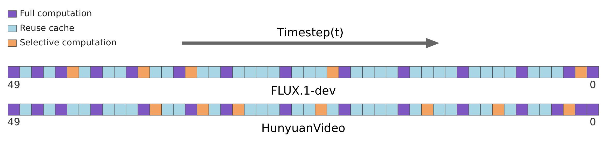

# T³Cache: Adaptive Feature Caching for Diffusion Transformers via Timestep, Transformer Layer, and Token Dynamics

<div align="center">
  <strong>If you find this project helpful, please give us a star 🌟.</strong>
</div>

## 🌠 Intro


Diffusion Transformers (DiTs) based generation models achieve state-of-the-art generation quality but incur substantial computational costs. Feature caching offers a promising acceleration solution by reusing intermediate outputs, yet existing methods suffer from fixed caching intervals that misalign with DiTs' non-uniform temporal dynamics and lack cross-dimensional error awareness. We propose **T³Cache**, a training-free multi-granularity adaptive caching framework that addresses these issues via residual cache policy search, Gaussian mixture policy modeling, and adaptive selective computation, to systematically mitigate error accumulation across **T**imestep, **T**ransformer-layer, and **T**oken dimensions. Extensive experiments with FLUX.1-dev and HunyuanVideo show that T³Cache achieves up to **4.50×** and **2.46×** acceleration for image and video generation with minimal quality loss, significantly outperforming existing caching methods.

_**Index Terms—**_ AIGC, Acceleration, DiT, Training-free, Feature Caching

## 📢 News

- **2026/09/01**: Code is open-sourced.

## 🤖 Supported Models



### [FLUX.1-dev](./T3Cache-Flux)

#### 1. Installation

Follow the [FLUX](https://github.com/black-forest-labs/flux) official documentation to set up the environment.

#### 2. Batch Inference Script

```bash
export OMP_NUM_THREADS=64
export TRANSFORMERS_OFFLINE=1
export HF_DATASETS_OFFLINE=1
HF_PATH="/root/autodl-tmp/models"
export HF_ENDPOINT="https://hf-mirror.com"
export HUGGINGFACE_HUB_CACHE="$HF_PATH"
export TRANSFORMERS_CACHE="$HF_PATH"
export HF_HOME="$HF_PATH"
export FLUX_DEV="$HF_PATH/black-forest-labs/FLUX.1-dev/flux1-dev.safetensors"
export AE="$HF_PATH/black-forest-labs/FLUX.1-dev/ae.safetensors"

export CACHE_POLICY="[1,0,1,0,1,0,1,2,2,1,2,2,2,1,2,0,2,1,1,0,0,0,1,0,0,0,1,0,0,0,1,0,0,0,1,0,0,0,1,0,0,0,1,0,2,1,2,2,1,1]"

cd /root/autodl-tmp/T3Cache-FLUX
python src/sample_seed.py \
  --prompt_file /root/autodl-tmp/work/DrawBench200.txt \
  --width 1024 \
  --height 1024 \
  --num_steps 50 \
  --guidance 3.5 \
  --seed 42 \
  --num_images_per_prompt 1 \
  --model_name flux-dev \
  --output_dir /root/autodl-tmp/work/t3_24_2_pre51_toca \
  --add_sampling_metadata
```

### [HunyuanVideo](./T3Cache-HunyuanVideo)

#### 1. Installation

Follow the [HunyuanVideo](https://github.com/Tencent/HunyuanVideo) official documentation to set up the environment.

#### 2. Batch Inference Script

```Bash
cd /root/autodl-tmp/T3Cache-HunyuanVideo

export CACHE_POLICY="[1,0,1,0,1,0,0,1,0,0,0,1,2,0,0,1,2,0,1,2,0,0,0,1,0,0,2,0,1,0,0,0,0,1,0,2,0,0,1,0,0,2,0,1,0,0,1,2,1,1]"
python sample_video_vbench.py \
  --flow-reverse \
  --cfg-scale 1.0 \
  --embedded-cfg-scale 6.0 \
  --model-resolution "720p" \
  --model-base "/root/autodl-tmp/T3Cache-HunyuanVideo/ckpts" \
  --dit-weight "/root/autodl-tmp/T3Cache-HunyuanVideo/ckpts/hunyuan-video-t2v-720p/transformers/mp_rank_00_model_states.pt" \
  --vbench-json-path "/root/autodl-tmp/T3Cache-HunyuanVideo/eval/VBench_full_info.json" \
  --save-path "/root/autodl-tmp/T3Cache-HunyuanVideo/eval/t3-0.4" \
  --save-path-suffix "" \
  --name-suffix "" \
  --load-key "module" \
  --neg-prompt "" \
  --batch-size 1 \
  --infer-steps 50 \
  --seed 42 \
  --video-size 480 640 \
  --video-length 65 \
  --use-cpu-offload \
  --num-videos-per-prompt 5 \
  --index-start 0 \
  --index-end -1  \
  --reproduce
```

## 🙏 Acknowledgment

- Thanks to [FLUX](https://github.com/black-forest-labs/flux) for their great work and codebase upon which we build T3Cache-FLUX.
- Thanks to [HunyuanVideo](https://github.com/Tencent/HunyuanVideo) for their great work and codebase upon which we build T3Cache-HunyuanVideo.
- Thanks to [ImageReward](https://github.com/THUDM/ImageReward) for Text-to-Image quality evaluation.
- Thanks to [VBench](https://github.com/Vchitect/VBench) for Text-to-Video quality evaluation.

## 📧 Contact

If you have any questions, please email `sqzx0524@163.com`.

## 🔗 Citation

To be added.
